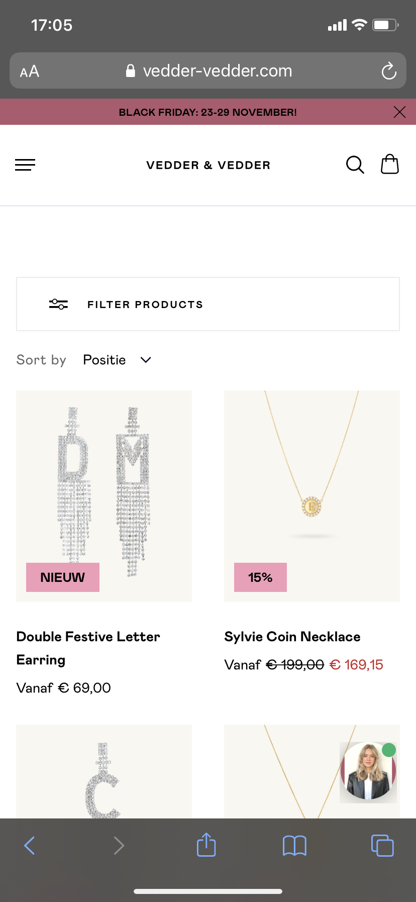

# Procesverslag
**Auteur:** -Amy van der Toorn-

Markdown cheat cheet: [Hulp bij het schrijven van Markdown](https://github.com/adam-p/markdown-here/wiki/Markdown-Cheatsheet). Nb. de standaardstructuur en de spartaanse opmaak zijn helemaal prima. Het gaat om de inhoud van je procesverslag. Besteedt de tijd voor pracht en praal aan je website.

## Bronnenlijst
1. https://www.bobdewebbouwer.com/ronde-hoeken-css-3/
2. https://www.vedder-vedder.com/nl/?gclid=Cj0KCQiAkuP9BRCkARIsAKGLE8VLjxiBg1fFRNmXtUWgLjyymK2_P0-voP7mo36BxLJt5WuAH6a9sHsaAq03EALw_wcB
3.

## Eindgesprek (week 7/8)

-dit ging goed & dit was lastig-

**Screenshot(s):**

-screenshot(s) van je eindresultaat-

## Voortgang 3 (week 6)

-same as voortgang 1-

## Voortgang 2 (week 5)

-same as voortgang 1-

## Voortgang 1 (week 3)

### Stand van zaken

-dit ging goed & dit was lastig-

Dit ging goed:
Ik begon voor mijn gevoel erg sterk aan mijn html en vervolgens ook aan mijn css. Het invoegen van afbeeldingen ging erg gemakkelijk en spelen met position ging ook erg goed.

- Opzet van html & css.
- Afbeeldingen invoegen.
- Het positioneren van afbeeldingen/knoppen/tekst.

Dit was lastig:
- Ik vind het onderwerp responsive nog best lastig, ik weet ook niet waar ik moet beginnen.
- Ik ben begonnen met het maken van een hamburger menu, alleen na 2 volle dagen hier aanzitten is het mij nog niet gelukt om het menu te fixen.
- Javascript vind ik ook nog erg lastig. Ik snap vaak niet hoe javascript nou echt werkt.
- Ik liep ook vast met het maken van een slider.

**Screenshot(s):**

-screenshot(s) van hoe ver je bent met korte uitleg-

### Agenda voor meeting

-samen met je groepje opstellen-

Student 1 -Amy:
| Hoe maak ik op een overzichtelijke manier een goede slider?
| Hoe maak ik een goed werkende hamburger menu?
| Ik heb veel losse p’tjes en h1 t/m h6 als ik die wil bewerken in   css, klopt het dan dat ik allemaal id geef?
| Ik ben een webshop aan het namaken, maar die verandert wel bijna   elke week.. Wat moet ik daaraan doen?
| Responsive
| Ik heb een div gebruikt, is dat handig?

Student 2 -Ellen:
| Headings (h1 - h6), wanneer pas je welke toe?
| Gebruik afbeelding: hoe kan je ‘m ‘kaderen’?

Student 3 -Jasmijn:
| Op de originele website staat een video over de volle        schermbreedte, op de desktop lijkt dit een andere video te zijn, moet ik hier nu 2 aparte video elementen voor maken en de ene dus overflow: hidden; geven?
| Mag ik een div gebruiken voor mijn header? Door een div te gebruiken bespaar ik mezelf zo ongeveer 30+ regels css en dat lijkt mij dus wel overzichtelijker.
| Is het een probleem als ik pas later met de NAV begin, en mij voornu focus op hoe de website er in zijn geheel uit ziet, aangezien de NAV een hamburger wordt die uitklapt met JS.
| Transparante zwarte overlay over een afbeelding > voorbeeld?

Student 4 -Beyza:
| Hoe pas ik text-shadow toe en bepaal ik de waarden?
| Hoe zorg ik ervoor dat transform: skewY alleen toegepast wordt op   de tekst?

### Verslag van meeting

-na afloop snel uitkomsten vastleggen-

## Breakdownschets (week 1)

-uitwerken voor de 1e werkgroep - eind van de eerste week-

## Intake (week 1)
-uitwerken voor de kick-off werkgroep - begin van de eerste week-

**Je startniveau:** -kies uit zwart, rood óf blauw-
rood

**Je focus:** -kies uit responsive óf surface plane-
allebei

**Je opdracht:** -link naar de website die je gaat namaken óf de naam van je eigen ontwerp-
Ik wil een website gaan namaken. De website heet Vedder & Vedder:
https://www.vedder-vedder.com/nl/

**Screenshot(s) van de eerste pagina (small screen):**

**Screenshot(s) van de tweede pagina (small screen):**

